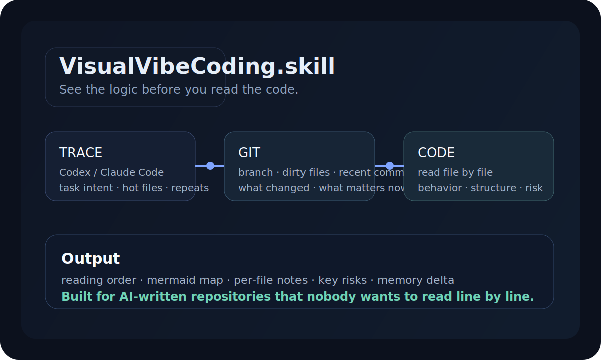
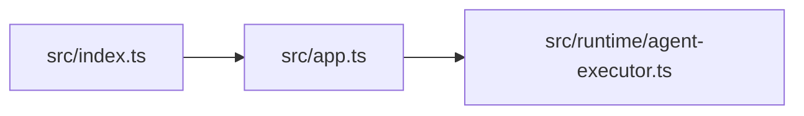

<div align="center">



# VisualVibeCoding.skill

### 看清代码逻辑，再决定要不要自己读代码。

[](#安装)
[](#安装)
[](#它会看什么)
[](#它会看什么)
[](#输出长什么样)

</div>

<table>
<tr>
<td width="56%" valign="top">

## 为什么做它

AI 写出来的项目，最烦的不是“代码烂”。

最烦的是：

- 你不知道主链路从哪里开始。
- 你不知道哪些文件只是陪跑，哪些文件真的在控局。
- 你不知道现在的代码，和过去几轮 Codex / Claude Code 实际做过的事，是否还对得上。
- 你不想把整个仓库读一遍，只想先知道它到底在干嘛、风险在哪。

`VisualVibeCoding.skill` 就是拿来做这个的。

它会先读轨迹，再读 Git，再逐个文件扫代码，最后给你一份**能直接看懂逻辑**的项目画像。

</td>
<td width="44%" valign="top">

## 一句话定位

> 不是 tree，不是 README 摘要，也不是静态代码搜索。
>
> 它是一个把**轨迹、Git、代码、记忆**压成同一份“项目逻辑地图”的 skill。

</td>
</tr>
</table>

## 它会看什么

1. `.codex/sessions` 和 `.codex/archived_sessions`
2. `~/.claude/projects`
3. 当前仓库的 Git 分支、脏文件、最近提交、近期变更文件
4. 仓库里的文本/代码文件
5. `~/.visual-vibe-coding/memory` 里的上次分析记忆

## 它输出什么

- 项目用途判断
- 重点阅读顺序
- 目录和文件的结构摘要
- Mermaid 结构图
- 轨迹高频文件和近期任务线索
- Git 近期演化线索
- 逐文件行为说明
- 风险清单
- 与上次分析相比的变化

## 输出长什么样

```md
# mailclaw · Visual Vibe Coding Report

> 读取了 79 个文本/代码文件，跳过 214 个生成物或二进制文件。

## 快速判断
- 我对项目用途的判断：A multi-agent email runtime and benchmark workbench.
- 高概率入口：`package.json`, `src/index.ts`, `src/app.ts`
- 轨迹概览：匹配到 4 条轨迹；来源 codex, claude；高频文件 src/app.ts x3, src/runtime/agent-executor.ts x2

## 建议阅读顺序
1. `src/index.ts`: 运行入口。优先原因：运行入口，轨迹提到 2 次，最近提交改过。
2. `src/app.ts`: 运行时编排。优先原因：运行入口，文件体量较大，内含风险点。

## 结构图

```

## 压力测试

本机已对 `mailclaw` 做过一次完整演练：

- 扫描了 274 个文本/代码文件
- 命中了 6 条 Codex 轨迹
- 直接把 `src/orchestration/service.ts`、`src/cli/mailctl-main.ts`、`src/app.ts` 拉成首屏重点
- 给出了“入口层 / 运行时 / 配置 / 测试 / 实验”的阅读顺序
- 记住了上一次分析的 Git HEAD，下一次会直接告诉你哪些重点变了

也就是说，这个 skill 已经能在真实的 `my-project` 仓库里快速形成一份可读的项目逻辑地图。

## 安装

### Codex

```bash
npx skills add https://github.com/dangoZhang/visual-vibe-coding.skill -a codex
```

### Claude Code

```bash
npx skills add https://github.com/dangoZhang/visual-vibe-coding.skill -a claude-code
```

### 本地开发

```bash
python3 -m pip install -e .
python3 -m pip install -e ".[test]"
python3 -m pytest -q
```

## 最常用命令

安装到 Codex / Claude Code 之后，直接用 skill 自带 wrapper：

```bash
~/.agents/skills/visual-vibe-coding/bin/visual-vibe-coding inspect \
  --project /path/to/repo \
  --memory \
  --output /tmp/project-report.md \
  --json-output /tmp/project-report.json
```

在仓库里本地开发时，也可以直接跑模块：

```bash
python3 -m visual_vibe_coding_skill.cli inspect \
  --project /path/to/repo \
  --memory \
  --output /tmp/project-report.md \
  --json-output /tmp/project-report.json
```

只看轨迹匹配：

```bash
python3 -m visual_vibe_coding_skill.cli scan-traces --project /path/to/repo
```

环境自检：

```bash
python3 -m visual_vibe_coding_skill.cli doctor
```

## 和原始 `vibecoding.skill` 的关系

这个项目基于 `dangoZhang/vibecoding.skill` 的思路收缩而来。

保留的东西：

- 读真实轨迹，不瞎猜
- 用 skill 作为入口，而不是只做一个脚本
- 让 Agent 把结果讲成人话

删掉的东西：

- 等级评估
- 分享卡
- 二级 skill 导出
- 画像营销链路
- 术语刷新和海量文案系统

换来的东西：

- 更聚焦的代码逻辑理解
- 更强的 Git / trace / memory 结合
- 更适合“先看懂项目，再决定要不要改”的真实工作流

## 适合谁

- 接手 AI 写出来的仓库，但不想立刻通读代码的人
- 想快速判断“这个项目现在到底跑成什么样了”的人
- 需要把项目主链路、风险和结构讲给别人听的人
- 想让 Codex / Claude Code 先替自己梳理，再决定下一步动作的人

## License

MIT
